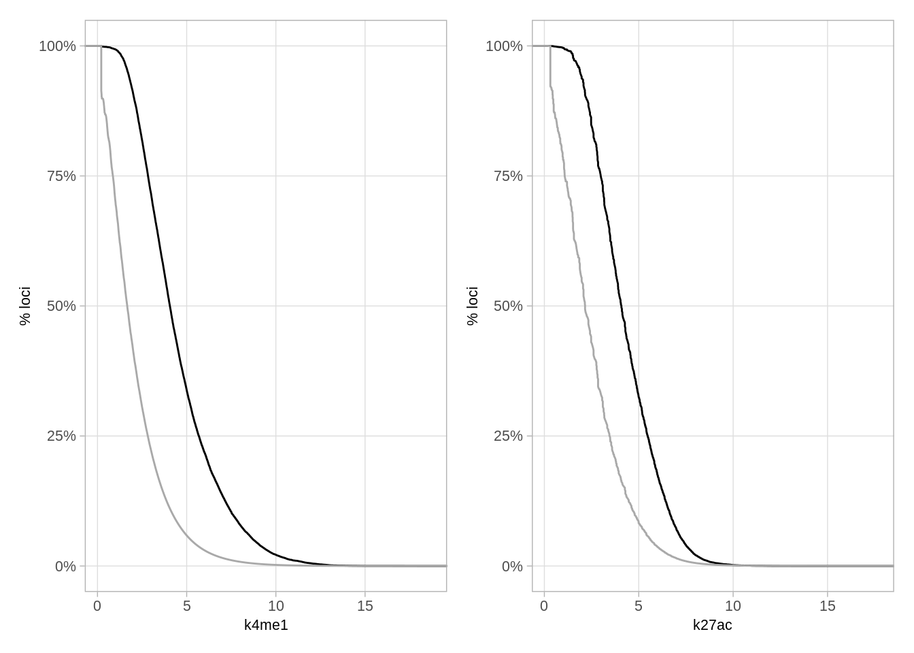

---
jupyter:
  jupytext:
    formats: ipynb,R:light,Rmd
    text_representation:
      extension: .Rmd
      format_name: rmarkdown
      format_version: '1.2'
      jupytext_version: 1.11.4
  kernelspec:
    display_name: R
    language: R
    name: ir
---

# Methylation analysis


## Initialization 


```r
if (!require("tet.gastru")) {
    if (!require("devtools")) {
        install.packages("devtools")
    }
    devtools::install(here("scripts/tet.gastru"))
}
```

```
## Loading required package: tet.gastru
```

```r
library(tet.gastru)
init()
```

```
## here() starts at /net/mraid14/export/tgdata/users/aviezerl/proj/tetchim/tet-gastrulation
```

## Define genomic contexts


#### CTCF motif


```r
gvtrack.create("ctcf", "ctcf_motif", "global.percentile.max")
```

#### CpG islands


```r
cgi_intervs <- gintervals.load("intervs.global.cpgIsland")
```

#### Time of replication (TOR)


```r
gvtrack.create("tor", "Encode.esd3.replichip.rep2", "avg")
gvtrack.iterator("tor", sshift = -15000, eshift = 15000)
```

#### K4me3/K27me3 peaks


Due to the large size of the ENCODE tracks which generated the CHIP peaks, we supply here also the result of our computation. You can see the details at: `scripts/tet.gastru/R/genomic-context.R`

* `define_k4me3_peaks()`
* `define_k27me_peaks()`
* `define_atac_peaks()`

In a nutshell - we aggregate functional annotation using data from ENCODE (Bing Ren's lab), and from the following paper: 

Xiang, Y., Zhang, Y., Xu, Q. et al. Epigenomic analysis of gastrulation identifies a unique chromatin state for primed pluripotency. Nat Genet 52, 95–105 (2020). https://doi.org/10.1038/s41588-019-0545-1


```r
k4me3_peaks <- fread(here("data/k4me3_peaks.tsv"))
k27me3_peaks <- fread(here("data/k27me3_peaks.tsv"))
atac_peaks <- fread(here("data/atac_peaks.tsv"))
```

#### Local 'dips' in methylation 


A local reduction in methylation can be an indicator for a functional element (e.g. enhancer). We screen for such regions at methylation of e8.5:


```r
meth_dips <- meth_dip_screen("e8_5", dip_size = 300, flank_size = 500, margin = 50, min_diff = 0.4, min_cov = 50, ret_values = TRUE) %cache_df% here("output/e8.5_dips.tsv") %>% as_tibble()
```

## Extract methylation data 


We will start by extracting all methylation data:


### All CpGs


We extract methylation in smoothed over 200bp from each side of the CpG, and not smoothed:


```r
meth_df_comp <- gextract_meth(
    c(
        comb_tracks,
        "e8_5",
        "Zhang_Nature_Genetics_2017.Ect_mCG",
        "Zhang_Nature_Genetics_2017.End_mCG",
        "Zhang_Nature_Genetics_2017.Mes_mCG",
        "Zhang_Nature_Genetics_2017.E65Epi_mCG"
    ),
    names = c(comb_names, "e8.5", "ecto", "endo", "meso", "epi"),
    extract_meth_calls = TRUE,
    d_expand = 200,
    annot_tracks = "ctcf"
) %>%
    mutate(e7.5.meth = ecto.meth + endo.meth + meso.meth, e7.5.cov = ecto.cov + endo.cov + meso.cov, e7.5 = e7.5.meth / e7.5.cov) %cache_df%
    here("output/cpg_meth_expand_200_comp.tsv") %>%
    as_tibble()
nrow(meth_df_comp)
```

```
## [1] 21342750
```

```r
head(meth_df_comp)
```

```
## # A tibble: 6 x 29
##   chrom   start     end      ctrl   tet_tko      e8.5      ecto      endo
## 1  chr1 3000573 3000574 1.0000000 0.8333333 0.6666667 0.7333333 0.4583333
## 2  chr1 3000725 3000726 1.0000000 0.8333333 0.5714286 0.6111111 0.4516129
## 3  chr1 3000900 3000901 1.0000000 1.0000000 0.3333333 0.6666667 0.4230769
## 4  chr1 3001345 3001346 0.8888889 0.8333333 0.9600000 0.8888889 0.4000000
## 5  chr1 3001393 3001394 0.8888889 0.8333333 0.9600000 0.8888889 0.4000000
## 6  chr1 3001630 3001631 1.0000000 0.7500000 1.0000000 0.7857143 0.8333333
##        meso       epi ctrl.cov tet_tko.cov e8.5.cov ecto.cov endo.cov meso.cov
## 1 0.7600000 0.6842105        8           6        6       15       24       25
## 2 0.7307692 0.6190476        8           6        7       18       31       26
## 3 0.6250000 0.5000000        1           2        3        9       26        8
## 4 0.7058824 1.0000000        9           6       25        9       15       17
## 5 0.7058824 1.0000000        9           6       25        9       15       17
## 6 1.0000000 1.0000000        5           4        2       14       12       19
##   epi.cov ctrl.meth tet_tko.meth e8.5.meth ecto.meth endo.meth meso.meth
## 1      19         8            5         4        11        11        19
## 2      21         8            5         4        11        14        19
## 3      14         1            2         1         6        11         5
## 4       5         8            5        24         8         6        12
## 5       5         8            5        24         8         6        12
## 6       8         5            3         2        11        10        19
##   epi.meth   ctcf intervalID e7.5.meth e7.5.cov      e7.5
## 1       13 0.6776          1        41       64 0.6406250
## 2       13 0.1325          1        44       75 0.5866667
## 3        7 0.8903          1        22       43 0.5116279
## 4        5 0.7201          1        26       41 0.6341463
## 5        5 0.2538          1        26       41 0.6341463
## 6        8 0.8507          1        40       45 0.8888889
```


```r
meth_df_comp_non_smoothed <- gextract_meth(
    c(
        comb_tracks,
        "e8_5",
        "Zhang_Nature_Genetics_2017.Ect_mCG",
        "Zhang_Nature_Genetics_2017.End_mCG",
        "Zhang_Nature_Genetics_2017.Mes_mCG",
        "Zhang_Nature_Genetics_2017.E65Epi_mCG"
    ),
    names = c(comb_names, "e8.5", "ecto", "endo", "meso", "epi"),
    extract_meth_calls = TRUE,
    d_expand = 200,
    annot_tracks = "ctcf"
) %>%
    mutate(e7.5.meth = ecto.meth + endo.meth + meso.meth, e7.5.cov = ecto.cov + endo.cov + meso.cov, e7.5 = e7.5.meth / e7.5.cov) %cache_df%
    here("output/cpg_meth_comp.tsv") %>%
    as_tibble()
nrow(meth_df_comp_non_smoothed)
```

```
## [1] 21342750
```

```r
head(meth_df_comp_non_smoothed)
```

```
## # A tibble: 6 x 29
##   chrom   start     end      ctrl   tet_tko      e8.5      ecto      endo
## 1  chr1 3000573 3000574 1.0000000 0.8333333 0.6666667 0.7333333 0.4583333
## 2  chr1 3000725 3000726 1.0000000 0.8333333 0.5714286 0.6111111 0.4516129
## 3  chr1 3000900 3000901 1.0000000 1.0000000 0.3333333 0.6666667 0.4230769
## 4  chr1 3001345 3001346 0.8888889 0.8333333 0.9600000 0.8888889 0.4000000
## 5  chr1 3001393 3001394 0.8888889 0.8333333 0.9600000 0.8888889 0.4000000
## 6  chr1 3001630 3001631 1.0000000 0.7500000 1.0000000 0.7857143 0.8333333
##        meso       epi ctrl.cov tet_tko.cov e8.5.cov ecto.cov endo.cov meso.cov
## 1 0.7600000 0.6842105        8           6        6       15       24       25
## 2 0.7307692 0.6190476        8           6        7       18       31       26
## 3 0.6250000 0.5000000        1           2        3        9       26        8
## 4 0.7058824 1.0000000        9           6       25        9       15       17
## 5 0.7058824 1.0000000        9           6       25        9       15       17
## 6 1.0000000 1.0000000        5           4        2       14       12       19
##   epi.cov ctrl.meth tet_tko.meth e8.5.meth ecto.meth endo.meth meso.meth
## 1      19         8            5         4        11        11        19
## 2      21         8            5         4        11        14        19
## 3      14         1            2         1         6        11         5
## 4       5         8            5        24         8         6        12
## 5       5         8            5        24         8         6        12
## 6       8         5            3         2        11        10        19
##   epi.meth   ctcf intervalID e7.5.meth e7.5.cov      e7.5
## 1       13 0.6776          1        41       64 0.6406250
## 2       13 0.1325          1        44       75 0.5866667
## 3        7 0.8903          1        22       43 0.5116279
## 4        5 0.7201          1        26       41 0.6341463
## 5        5 0.2538          1        26       41 0.6341463
## 6        8 0.8507          1        40       45 0.8888889
```

## Distribution of TET-TKO vs WT methylation (Figure 5B)


```r
options(repr.plot.width = 7, repr.plot.height = 7)
min_cov <- 20
plot_smooth_cpg_scatter(meth_df_comp, "ctrl", "tet_tko", min_cov, "Control", "Tet-TKO")
```


```r
options(repr.plot.width = 5, repr.plot.height = 6)
plot_smooth_legend(c("white", "lightblue", "blue", "darkblue", "yellow", "gold", "orange", "red", "darkred"))
```


## Methylation in TADs


We took TAD defnitions from Nagano et al., 2017:


```r
tad_intervs <- gintervals.load("scell.nextera.pool_good_hyb_es_b_TADs") %>% as_tibble()
dim(tad_intervs)
```

```
## [1] 2461    4
```

We can then extract average methylation in TADs and then remove from it ('punctuate') the methylation calls that are at k4me3 or k27me3 peaks, or that are at methylation dips or ATAC peaks:


```r
tads_meth <- get_cpg_meth_tads(tad_intervs, meth_dips, k4me3_peaks, k27me3_peaks, atac_peaks) %cache_df% here("output/tads_meth.tsv") %>% as_tibble()
```

### Compare TAD methylation in Ctrl and TET-tko (Figure 5C)


```r
options(repr.plot.width = 7, repr.plot.height = 7)
df <- tads_meth %>%
    filter(ctrl.cov >= 3e3, tet_tko.cov >= 3e3) %>%
    mutate(l = end - start) %>%
    filter(l >= 5e4) %>%
    mutate(ctrl_bins = cut(ctrl, c(0.7, 0.8, 0.83, 0.86, 0.89, 1))) %>%
    select(chrom, start, end, ctrl_bins, Ctrl = ctrl, TKO = tet_tko) %>%
    gather("type", "meth", -(chrom:ctrl_bins))

df %>% count(ctrl_bins)
```

```
## # A tibble: 5 x 2
##     ctrl_bins    n
## 1   (0.7,0.8]   38
## 2  (0.8,0.83]  176
## 3 (0.83,0.86]  864
## 4 (0.86,0.89] 2746
## 5    (0.89,1]  866
```

```r
p_tads_boxp <- df %>%
    ggplot(aes(x = ctrl_bins, y = meth, fill = type)) +
    geom_boxplot(lwd = 0.01, outlier.size = 0.001, fatten = 0.1) +
    scale_fill_manual(name = "", values = c("Ctrl" = "#00468BFF", "TKO" = "#ED0000FF")) +
    theme(aspect.ratio = 1) +
    vertical_labs() +
    xlab("Ctrl meth.") +
    ylab("TADs meth.")
p_tads_boxp
```


```r
df <- tads_meth %>%
    filter(ctrl.cov >= 3e3, tet_tko.cov >= 3e3) %>%
    mutate(l = end - start) %>%
    filter(l >= 5e4) %>%
    summarise(
        tet_tko_mean = mean(tet_tko),
        tet_tko_sd = sd(tet_tko, na.rm = TRUE),
        ctrl_mean = mean(ctrl),
        ctrl_sd = sd(ctrl, na.rm = TRUE),
        e7.5_mean = mean(e7.5),
        e7.5_sd = sd(e7.5, na.rm = TRUE),
        e8.5_mean = mean(e8.5),
        e8.5_sd = sd(e8.5, na.rm = TRUE)
    )
df
```

```
## # A tibble: 1 x 8
##   tet_tko_mean tet_tko_sd ctrl_mean    ctrl_sd e7.5_mean    e7.5_sd e8.5_mean
## 1    0.9017096 0.02115242 0.8723345 0.02194502 0.7953908 0.03149332 0.8195952
##      e8.5_sd
## 1 0.02755257
```

```r
df %>%
    summarise_at(vars(everything()), function(x) round(x, digits = 2))
```

```
## # A tibble: 1 x 8
##   tet_tko_mean tet_tko_sd ctrl_mean ctrl_sd e7.5_mean e7.5_sd e8.5_mean e8.5_sd
## 1          0.9       0.02      0.87    0.02       0.8    0.03      0.82    0.03
```

```r
ks.test(tads_meth$ctrl, tads_meth$tet_tko)
```

```
## Warning in ks.test(tads_meth$ctrl, tads_meth$tet_tko): p-value will be
## approximate in the presence of ties
```

```
## 
## 	Two-sample Kolmogorov-Smirnov test
## 
## data:  tads_meth$ctrl and tads_meth$tet_tko
## D = 0.62739, p-value < 2.2e-16
## alternative hypothesis: two-sided
```

We can see that that the variation in background methylation between TADs was greatly diminished in Tet-TKO cells.


### Figure S6A


```r
options(repr.plot.width = 7, repr.plot.height = 7)
df <- tads_meth %>%
    filter(ctrl.cov >= 3e3, tet_tko.cov >= 3e3) %>%
    mutate(l = end - start) %>%
    filter(l >= 5e4) %>%
    mutate(ctrl_bins = cut(ctrl, c(0.7, 0.8, 0.83, 0.86, 0.89, 1))) %>%
    select(chrom, start, end, ctrl_bins, Ctrl = ctrl, WT = e8.5) %>%
    gather("type", "meth", -(chrom:ctrl_bins))

df %>% count(ctrl_bins)
```

```
## # A tibble: 5 x 2
##     ctrl_bins    n
## 1   (0.7,0.8]   38
## 2  (0.8,0.83]  176
## 3 (0.83,0.86]  864
## 4 (0.86,0.89] 2746
## 5    (0.89,1]  866
```

```r
p_tads_wt_boxp <- df %>%
    ggplot(aes(x = ctrl_bins, y = meth, fill = type)) +
    geom_boxplot(lwd = 0.01, outlier.size = 0.001, fatten = 0.1) +
    scale_fill_manual(name = "", values = c("Ctrl" = "#00468BFF", "WT" = "#42B540FF")) +
    theme(aspect.ratio = 1) +
    vertical_labs() +
    xlab("Ctrl meth.") +
    ylab("TADs meth.")
p_tads_wt_boxp
```


We can see that our analysis infers higher methylation levels in the embryo compared to some previously published WT data. This is likely due to the elimination of extraembryonic ectoderm from the analysis, which represents a more hypomethylated (Smith et al., 2017) cell population that can affect the estimation of average methylation when not excluded.


## TAD methylation at different TOR regimes (Figure 5D)


```r
options(repr.plot.width = 7, repr.plot.height = 7)
p_tads_tor <- tads_meth %>%
    filter(ctrl.cov >= 3e3, tet_tko.cov >= 3e3) %>%
    mutate(l = end - start) %>%
    filter(l >= 5e4) %>%
    rename(Ctrl = ctrl, TKO = tet_tko) %>%
    pivot_longer(Ctrl:TKO, names_to = "type", values_to = "meth") %>%
    ggplot(aes(x = -tor, y = meth, color = type)) +
    geom_smooth(method = lm, se = FALSE) +
    geom_point(size = 0.01, alpha = 0.1) +
    theme(aspect.ratio = 1) +
    xlab("TOR") +
    ylab("Methylation") +
    scale_color_manual(name = "", values = c("Ctrl" = "#00468BFF", "TKO" = "#ED0000FF")) +
    scale_x_continuous(breaks = c(-1, 1), labels = c("Early", "Late")) +
    vertical_labs()
p_tads_tor
```

```
## `geom_smooth()` using formula 'y ~ x'
```


```r
tads_meth %>%
    filter(ctrl.cov >= 3e3, tet_tko.cov >= 3e3) %>%
    mutate(l = end - start) %>%
    filter(l >= 5e4) %>%
    pivot_longer(ctrl:tet_tko, names_to = "type", values_to = "meth") %>%
    group_by(type) %>%
    summarise(cor = cor(meth, tor))
```

```
## # A tibble: 2 x 2
##      type        cor
## 1    ctrl -0.2692618
## 2 tet_tko  0.2265352
```

We see that that lower background methylation is linked with early replicating TADs in control and a reciprocal effect in Tet-TKO.
These data support a role for widespread TET-mediated de-methylation in early replicating TADs, which is lost upon Tet knockout. Such de-methylation may rely on the enhanced accessibility of early replicating domains as part of the chromosomal A-compartment (López-Moyado et al., 2019; Pope et al., 2014).


## Low methylation hotspots


We extract chromatin marks at hotspots of low methylation (control methylation <0.25):


```r
define_chip_vtracks()

low_meth_df <- meth_df_comp %>%
    select(chrom, start, end, ctrl, tet_tko, e8.5, ctrl.cov, tet_tko.cov, e8.5.cov) %>%
    gextract.left_join(
        c(
            "pmax(-log2(1-ecto_k27me3),-log2(1-endo_k27me3),-log2(1-meso_k27me3),-log2(1-ps_k27me3),-log2(1-e6_epi_k27me3),-log2(1-e5_epi_k27me3),-log2(1-e6_ve_k27me3),-log2(1-e10_fc_k27me3),-log2(1-e10_forebrain_k27me3),-log2(1-e10_heart_k27me3),-log2(1-e10_hindbrain_k27me3),-log2(1-e10_limb_k27me3),-log2(1-e10_midbrain_k27me3),-log2(1-es_k27me3), na.rm=TRUE)",
            "pmax(-log2(1-e10_limb_k4me3),-log2(1-e10_heart_k4me3),-log2(1-e10_midbrain_k4me3),-log2(1-e10_hindbrain_k4me3),-log2(1-e10_forebrain_k4me3),-log2(1-e11_liver_k4me3),-log2(1-ecto_k4me3),-log2(1-endo_k4me3),-log2(1-meso_k4me3),-log2(1-ps_k4me3),-log2(1-e6_epi_k4me3),-log2(1-e5_epi_k4me3),-log2(1-e6_ve_k4me3), na.rm=TRUE)"
        ),
        iterator = ., intervals = ., colnames = c("k27me3", "k4me3")
    ) %>%
    select(-(chrom1:end1)) %cache_df%
    here("output/meth_marks_smoothed.tsv") %>%
    as_tibble()
```

### Figure S6B


```r
options(repr.plot.width = 14, repr.plot.height = 7)
df <- low_meth_df %>%
    filter(ctrl.cov >= 10) %>%
    mutate(low_meth = ifelse(ctrl <= 0.25, "Low meth.", "Other"))

p_k4me3 <- df %>%
    ggplot(aes(x = k4me3, color = low_meth, y = 1 - ..y..)) +
    stat_ecdf() +
    scale_color_manual("", values = c("darkblue", "darkgray")) +
    scale_y_continuous(labels = scales::percent) +
    ylab("% of loci") +
    xlab("H3K4me3")

p_k27me3 <- df %>%
    ggplot(aes(x = k27me3, color = low_meth, y = 1 - ..y..)) +
    stat_ecdf() +
    scale_color_manual("", values = c("darkblue", "darkgray")) +
    scale_y_continuous(labels = scales::percent) +
    ylab("% of loci") +
    xlab("H3K27me3")

p_k4me3 + p_k27me3
```


## K4me3/K27me3 hospots (Figure 5E)


### K4me3 hotspots


```r
d_k4me3 <- extract_meth_at_context(k4me3_peaks) %cache_df% here("output/k4me3_meth_comp.tsv") %>% as_tibble()
```


```r
options(repr.plot.width = 7, repr.plot.height = 7)
df_k4me3 <- d_k4me3 %>%
    filter(ctrl.cov >= 50, tet_tko.cov >= 50) %>%
    gintervals.neighbors1(k27me3_peaks) %>%
    mutate(type = ifelse(dist == 0, "bivalent", "other")) %>%
    select(-(chrom1:dist)) %>%
    mutate(l = end - start) %>%
    filter(abs(l) >= 3e3)

p_k4me3 <- df_k4me3 %>%
    ggplot(aes(x = ctrl, y = tet_tko, color = type)) +
    geom_point(size = 0.1, alpha = 0.5) +
    theme(aspect.ratio = 1) +
    geom_abline() +
    theme(aspect.ratio = 1) +
    scale_color_manual(name = "", values = c("bivalent" = "darkred", "other" = "darkgray")) +
    ggtitle("K4me3") +
    xlab("WT") +
    ylab("TKO ") +
    xlim(0, 1) +
    ylim(0, 1)

p_k4me3
```


```r
df_k4me3 %>% count(type)
```

```
## # A tibble: 2 x 2
##       type   n
## 1 bivalent 668
## 2    other 285
```

```r
nrow(df_k4me3)
```

```
## [1] 953
```


```r
df_k4me3 %>%
    select(chrom:end, ctrl, tet_tko, type) %>%
    mutate(diff = tet_tko - ctrl) %>%
    filter(diff >= 0) %>%
    summarise(min_diff = min(diff), max_diff = max(diff), m = mean(diff), sd = sd(diff)) %>%
    summarise_at(vars(everything()), scales::percent)
```

```
## # A tibble: 1 x 4
##   min_diff max_diff  m sd
## 1       0%      70% 8% 7%
```

### K27me3 hotspots


```r
d_k27me3 <- extract_meth_at_context(k27me3_peaks) %cache_df% here("output/k27me3_meth_comp.tsv") %>% as_tibble()
```

Polycomb without methylation of k4me3 regions ("punctuated"):


```r
d_k27me3_punc <- gextract_meth(c(comb_tracks, "e8_5", "Zhang_Nature_Genetics_2017.Ect_mCG", "Zhang_Nature_Genetics_2017.End_mCG", "Zhang_Nature_Genetics_2017.Mes_mCG", "Zhang_Nature_Genetics_2017.E65Epi_mCG"), names = c(comb_names, "e8.5", "ecto", "endo", "meso", "epi"), extract_meth_calls = TRUE, intervals = k27me3_peaks, join_intervals = TRUE) %>%
    mutate(e7.5.meth = ecto.meth + endo.meth + meso.meth, e7.5.cov = ecto.cov + endo.cov + meso.cov, e7.5 = e7.5.meth / e7.5.cov) %>%
    gintervals.neighbors1(k4me3_peaks) %>%
    filter(dist != 0) %>%
    group_by(chrom1, start1, end1) %>%
    summarise_at(vars(ends_with("cov"), ends_with("meth")), sum, na.rm = TRUE) %>%
    rename(chrom = chrom1, start = start1, end = end1) %>%
    mutate(ctrl = ctrl.meth / ctrl.cov, tet_tko = tet_tko.meth / tet_tko.cov, e8.5 = e8.5.meth / e8.5.cov, e7.5 = e7.5.meth / e7.5.cov, epi = epi.meth / epi.cov) %>%
    ungroup() %cache_df% here("output/k27me3_meth_comp_k4me3_punc.tsv") %>%
    as_tibble()
```


```r
options(repr.plot.width = 7, repr.plot.height = 7)
df <- d_k27me3 %>%
    filter(ctrl.cov >= 50, tet_tko.cov >= 50) %>%
    gintervals.neighbors1(k4me3_peaks) %>%
    mutate(type = ifelse(dist == 0, "bivalent", "other")) %>%
    select(-(chrom1:dist)) %>%
    mutate(l = end - start) %>%
    filter(abs(l) >= 3e3)
p_k27me3 <- df %>%
    ggplot(aes(x = ctrl, y = tet_tko, color = type)) +
    geom_point(size = 0.5) +
    theme(aspect.ratio = 1) +
    geom_abline() +
    theme_bw() +
    theme(aspect.ratio = 1) +
    scale_color_manual(name = "", values = c("bivalent" = "darkred", "other" = "darkgray")) +
    ggtitle("H3K27me3") +
    xlab("Ctrl") +
    ylab("TKO")

p_k27me3
```


```r
df %>% count(type)
```

```
## # A tibble: 2 x 2
##       type    n
## 1 bivalent 2298
## 2    other  402
```

```r
nrow(df)
```

```
## [1] 2700
```

H3k27me3 hotspots while removing H3K4me3 methylation:


```r
options(repr.plot.width = 7, repr.plot.height = 7)
df_punc <- d_k27me3_punc %>%
    filter(ctrl.cov >= 50, tet_tko.cov >= 50) %>%
    gintervals.neighbors1(k4me3_peaks) %>%
    mutate(type = ifelse(dist == 0, "bivalent", "other")) %>%
    select(-(chrom1:dist)) %>%
    mutate(l = end - start) %>%
    filter(abs(l) >= 3e3)

p_k27_punc <- df_punc %>%
    ggplot(aes(x = ctrl, y = tet_tko, color = type)) +
    geom_point(size = 0.1, alpha = 0.5) +
    theme(aspect.ratio = 1) +
    geom_abline() +
    theme(aspect.ratio = 1) +
    scale_color_manual(name = "", values = c("bivalent" = "darkred", "other" = "darkgray")) +
    ggtitle("H3K27me3") +
    xlab("Ctrl") +
    ylab("TKO")
p_k27_punc
```


```r
df_punc %>%
    select(chrom:end, ctrl, tet_tko) %>%
    mutate(diff = tet_tko - ctrl) %>%
    filter(diff >= 0) %>%
    summarise(min_diff = min(diff), max_diff = max(diff), m = mean(diff), sd = sd(diff)) %>%
    summarise_at(vars(everything()), scales::percent)
```

```
## # A tibble: 1 x 4
##   min_diff max_diff   m  sd
## 1       0%      75% 23% 12%
```


```r
bind_rows(df_k4me3, df_punc) %>%
    select(chrom:end, ctrl, tet_tko, type) %>%
    mutate(diff = tet_tko - ctrl) %>%
    filter(diff >= 0) %>%
    summarise(min_diff = min(diff), max_diff = max(diff), m = mean(diff), sd = sd(diff)) %>%
    summarise_at(vars(everything()), scales::percent)
```

```
## # A tibble: 1 x 4
##   min_diff max_diff   m  sd
## 1       0%      75% 19% 13%
```


```r
n_above <- bind_rows(df_k4me3, df_punc) %>%
    select(chrom:end, ctrl, tet_tko, type) %>%
    filter(ctrl <= 0.25, tet_tko >= 0.5) %>%
    nrow()

scales::percent(n_above / nrow(bind_rows(df_k4me3, df_punc)))
```

```
## [1] "5%"
```


```r
df_punc %>% count(type)
```

```
## # A tibble: 2 x 2
##       type    n
## 1 bivalent 2185
## 2    other  402
```

```r
nrow(df_punc)
```

```
## [1] 2587
```

## Loci linked with CTCF occupancy (Figure 5F)


```r
tet_df <- meth_df_comp %>% filter(ctcf >= 0.999)
tet_df <- tet_df %>%
    gintervals.neighbors1(k4me3_peaks) %>%
    mutate(type = ifelse(dist == 0, "k4me3", "other")) %>%
    select(chrom:end, ctrl.cov, tet_tko.cov, ctrl, tet_tko, ctcf, type)
```


```r
options(repr.plot.width = 7, repr.plot.height = 7)
min_cov <- 20
p_ctcf <- tet_df %>%
    filter(ctrl.cov >= min_cov, tet_tko.cov >= min_cov) %>%
    ggplot(aes(x = ctrl, y = tet_tko)) +
    geom_point(size = 0.001, alpha = 0.5) +
    theme(aspect.ratio = 1) +
    geom_abline(color = "red") +
    facet_wrap(~type) +
    ggtitle("CTCF peaks") +
    xlab("WT") +
    ylab("TKO")

p_ctcf
```


```r
tet_df %>%
    filter(ctrl.cov >= min_cov, tet_tko.cov >= min_cov) %>%
    count(type)
```

```
## # A tibble: 2 x 2
##    type     n
## 1 k4me3  3276
## 2 other 17860
```

## Methylation at Exons and Non-H3K4me3 Promoters (Figure 5G)


### Exons


```r
d_exons <- extract_meth_at_context("intervs.global.exons") %cache_df% here("output/exons_meth_comp.tsv") %>% as_tibble()
d_exons <- d_exons %>%
    gintervals.neighbors1(k4me3_peaks) %>%
    filter(abs(dist) > 0) %>%
    select(-(chrom1:dist)) %>%
    gintervals.neighbors1(k27me3_peaks) %>%
    filter(abs(dist) > 0) %>%
    select(-(chrom1:dist))
```


```r
options(repr.plot.width = 7, repr.plot.height = 7)
p_exons <- d_exons %>%
    filter(ctrl.cov >= 30, tet_tko.cov >= 30) %>%
    ggplot(aes(x = ctrl, y = tet_tko)) +
    geom_point(size = 0.1, alpha = 0.5) +
    theme(aspect.ratio = 1) +
    geom_abline() +
    theme(aspect.ratio = 1) +
    ggtitle("Exons") +
    xlab("Ctrl") +
    ylab("TKO")
p_exons
```


```r
d_exons %>%
    filter(ctrl.cov >= 30, tet_tko.cov >= 30) %>%
    nrow()
```

```
## [1] 47734
```

### Compare with the WT (Figure S6C):


```r
options(repr.plot.width = 7, repr.plot.height = 7)
p_exons_vs_wt <- d_exons %>%
    filter(e7.5.cov >= 30, tet_tko.cov >= 30) %>%
    ggplot(aes(x = e7.5, y = tet_tko)) +
    geom_point(size = 0.1, alpha = 0.5) +
    theme(aspect.ratio = 1) +
    geom_abline() +
    theme(aspect.ratio = 1) +
    ggtitle("Exons") +
    xlab("WT") +
    ylab("TKO")
p_exons_vs_wt
```


### Promoters


```r
d_promoters <- extract_meth_at_context(get_promoters()) %cache_df% here("output/promoter_meth_comp.tsv") %>% as_tibble()
```

Annotate promoters to 'k4me3', 'k27me3', 'bivalent' and other ('none'):


```r
d_promoters <- d_promoters %>%
    gintervals.neighbors1(k4me3_peaks) %>%
    mutate(k4me3 = dist == 0) %>%
    select(-(chrom1:dist)) %>%
    gintervals.neighbors1(k27me3_peaks) %>%
    mutate(k27me3 = dist == 0) %>%
    select(-(chrom1:dist)) %>%
    mutate(type = case_when(k27me3 & k4me3 ~ "bivalent", k4me3 ~ "k4me3", k27me3 ~ "k27me3", TRUE ~ "none"))
```

Add time of replication annotation:


```r
d_promoters <- gextract.left_join("tor", intervals = d_promoters, iterator = d_promoters) %>%
    as_tibble() %>%
    select(-(chrom1:end1))
```

We match the promoters with marginal expression data from the gastrulation atlas (Mittnenzweig, Meishar et. al. Cell 2021):


```r
atlas_egc <- readr::read_rds(here("data/atlas_egc.rds"))
atlas_marginal <- tibble(gene = rownames(atlas_egc), expr = log2(rowSums(atlas_egc) + 1e-5))
```

#### Non-H3Kme3 promoters


We require a coverage of at least 30: 


```r
df <- d_promoters %>%
    filter(type == "none", ctrl.cov >= 30, tet_tko.cov >= 30) %>%
    left_join(get_promoters() %>% select(chrom:end, gene = geneSymbol)) %>%
    left_join(atlas_marginal %>% separate_rows(gene, sep = ";")) %>%
    gintervals.neighbors1(cgi_intervs) %>%
    mutate(cgi = ifelse(dist == 0, "cgi", "other")) %>%
    filter(!is.na(expr))
```

```
## Joining, by = c("chrom", "start", "end")
## Joining, by = "gene"
```


```r
df %>%
    filter(!is.na(ctrl), !is.na(tet_tko)) %>%
    nrow()
```

```
## [1] 3381
```


```r
options(repr.plot.width = 7, repr.plot.height = 7)
p_prom_none <- df %>%
    ggplot(aes(x = ctrl, y = tet_tko)) +
    geom_point(size = 0.1, alpha = 0.5) +
    theme(aspect.ratio = 1) +
    geom_abline() +
    theme(aspect.ratio = 1) +
    ggtitle("Non-H3K4me3 Promoters") +
    xlab("Ctrl") +
    ylab("TKO")
p_prom_none
```


### Compare with the WT (Figure S6C):


```r
options(repr.plot.width = 7, repr.plot.height = 7)
p_prom_none_vs_wt <- df %>%
    filter(e7.5.cov >= 30, tet_tko.cov >= 30) %>%
    ggplot(aes(x = e7.5, y = tet_tko)) +
    geom_point(size = 0.1, alpha = 0.5) +
    theme(aspect.ratio = 1) +
    geom_abline() +
    theme(aspect.ratio = 1) +
    ggtitle("Non-H3K4me3 Promoters") +
    xlab("WT") +
    ylab("TKO")
p_prom_none_vs_wt
```


## Promoter methylation vs expression (Figure S6D/S6E)


Load expression data of all the types and of epiblast:


```r
egc_bulk <- fread(here("data/eg_bulk.tsv")) %>% as_tibble()
egc_epiblast <- fread(here("data/eg_epiblast.tsv")) %>% as_tibble()
```

We generate a table for all the covered promoters in wt.


```r
promoters_table <- d_promoters %>%
    left_join(get_promoters() %>% select(chrom:end, strand, geneSymbol), by = c("chrom", "start", "end")) %>%
    filter(ctrl.cov >= 30) %>%
    separate_rows(geneSymbol, sep = ";") %>%
    # when there are alternative promoters - keep the one with lower methylation
    arrange(geneSymbol, ctrl) %>%
    distinct(geneSymbol, .keep_all = TRUE) %>%
    # add expression data
    left_join(egc_bulk %>% separate_rows(gene, sep = ";") %>% rename(geneSymbol = gene), by = "geneSymbol") %>%
    mutate_at(vars(ends_with("bulk")), function(x) log2(x + 1e-5)) %cache_df%
    here("output/promoter_table.tsv") %>%
    as_tibble()
```


```r
promoters_table %>%
    filter(wt_bulk >= -14) %>%
    count(type) %>%
    mutate(p = n / sum(n), perc = scales::percent(p))
```

```
## # A tibble: 4 x 4
##       type    n           p  perc
## 1 bivalent  542 0.107539683 10.8%
## 2   k27me3   21 0.004166667  0.4%
## 3    k4me3 4277 0.848611111 84.9%
## 4     none  200 0.039682540  4.0%
```


```r
p_expr_marks <- promoters_table %>%
    mutate(expr = cut(wt_bulk, c(-17, -16, -14, 0), labels = c("low", "mid", "high"))) %>%
    filter(!is.na(expr)) %>%
    count(expr, type) %>%
    ggplot(aes(x = expr, y = n, fill = type)) +
    geom_col() +
    scale_fill_manual(name = "", values = c("bivalent" = "darkred", "k27me3" = "darkblue", "k4me3" = "darkgreen", "none" = "darkgray")) +
    ylab("# of promoters") +
    xlab("Gene expression")

p_expr_marks
```


```r
define_chip_vtracks()
intervs <- promoters_table %>% select(chrom:end, geneSymbol, wt_bulk)
marks_expr <- gextract.left_join(
    c(
        "pmax(-log2(1-ecto_k27me3),-log2(1-endo_k27me3),-log2(1-meso_k27me3),-log2(1-ps_k27me3),-log2(1-e6_epi_k27me3),-log2(1-e5_epi_k27me3),-log2(1-e6_ve_k27me3),-log2(1-e10_fc_k27me3),-log2(1-e10_forebrain_k27me3),-log2(1-e10_heart_k27me3),-log2(1-e10_hindbrain_k27me3),-log2(1-e10_limb_k27me3),-log2(1-e10_midbrain_k27me3),-log2(1-es_k27me3), na.rm=TRUE)",
        "pmax(-log2(1-e10_limb_k4me3),-log2(1-e10_heart_k4me3),-log2(1-e10_midbrain_k4me3),-log2(1-e10_hindbrain_k4me3),-log2(1-e10_forebrain_k4me3),-log2(1-e11_liver_k4me3),-log2(1-ecto_k4me3),-log2(1-endo_k4me3),-log2(1-meso_k4me3),-log2(1-ps_k4me3),-log2(1-e6_epi_k4me3),-log2(1-e5_epi_k4me3),-log2(1-e6_ve_k4me3), na.rm=TRUE)"
    ),
    iterator = intervs, intervals = intervs, colnames = c("k27me3", "k4me3")
) %>%
    select(-(chrom1:end1)) %cache_df% here("output/marks_expr.tsv") %>%
    as_tibble()
```


```r
options(repr.plot.width = 14, repr.plot.height = 5)
marks_expr %>%
    mutate(expr = cut(wt_bulk, c(-17, -16, -14, 0), labels = c("low", "mid", "high"))) %>%
    filter(!is.na(expr)) %>%
    ggplot(aes(x = k4me3, y = k27me3)) +
    geom_point(size = 0.1) +
    facet_wrap(~expr) +
    theme(aspect.ratio = 1)
```


```r
marks_expr %>%
    mutate(expr = cut(wt_bulk, c(-17, -16, -14, 0), labels = c("low", "mid", "high"))) %>%
    filter(!is.na(k4me3)) %>%
    count(expr)
```

```
## # A tibble: 4 x 2
##   expr     n
## 1  low 11758
## 2  mid  6214
## 3 high  5040
## 4 <NA>     6
```

### Figure S6D


```r
options(repr.plot.width = 10, repr.plot.height = 4)
p_k4me3 <- marks_expr %>%
    mutate(expr = cut(wt_bulk, c(-17, -16, -14, 0), labels = c("low", "mid", "high"))) %>%
    filter(!is.na(expr)) %>%
    ggplot(aes(x = k4me3, color = expr, y = 1 - ..y..)) +
    geom_vline(xintercept = 7, linetype = "dashed") +
    stat_ecdf() +
    ggsci::scale_color_npg(name = "Expression") +
    ylab("% of promoters") +
    scale_y_continuous(label = scales::percent)
p_k27me3 <- marks_expr %>%
    mutate(expr = cut(wt_bulk, c(-17, -16, -14, 0), labels = c("low", "mid", "high"))) %>%
    filter(!is.na(expr)) %>%
    ggplot(aes(x = k27me3, color = expr, y = 1 - ..y..)) +
    geom_vline(xintercept = 7, linetype = "dashed") +
    stat_ecdf() +
    ggsci::scale_color_npg(name = "Expression") +
    ylab("% of promoters") +
    scale_y_continuous(label = scales::percent)

p_k4me3 + p_k27me3
```


```r
promoters_table %>%
    filter(type == "none") %>%
    mutate(expr = cut(wt_bulk, c(-17, -16, -14, 0), labels = c("Low Expr.", "Mid Expr.", "High Expr."))) %>%
    filter(!is.na(expr)) %>%
    filter(ctrl.cov >= 30, tet_tko.cov >= 30) %>%
    count(expr)
```

```
## # A tibble: 3 x 2
##         expr    n
## 1  Low Expr. 3428
## 2  Mid Expr.  254
## 3 High Expr.  158
```

### Figure S6E


```r
options(repr.plot.width = 14, repr.plot.height = 4)
p_wt_tko_expr <- promoters_table %>%
    filter(type == "none") %>%
    mutate(expr = cut(wt_bulk, c(-17, -16, -14, 0), labels = c("Low Expr.", "Mid Expr.", "High Expr."))) %>%
    filter(!is.na(expr)) %>%
    filter(ctrl.cov >= 30, tet_tko.cov >= 30) %>%
    ggplot(aes(x = ctrl, y = tet_tko)) +
    geom_abline(linetype = "dashed") +
    geom_point(size = 0.1) +
    facet_wrap(~expr) +
    theme(aspect.ratio = 1) +
    vertical_labs() +
    xlab("Ctrl.") +
    ylab("TKO")

p_wt_tko_expr
```


## Putative enhancers


We extract CHIP data for methylation dips which do not have a known functional annotation (h4me3, k27me3 or promoters):


```r
bg_intervs <- gintervals.diff(meth_dips, k4me3_peaks) %>%
    gintervals.diff(k27me3_peaks) %>%
    gintervals.diff(get_promoters())
```


```r
define_chip_vtracks()

meth_dips_chip <- bg_intervs %>%
    gextract.left_join(
        c(
            "pmax(-log2(1-e10_limb_k4me1),-log2(1-e10_heart_k4me1),-log2(1-e10_fc_k4me1),-log2(1-e10_midbrain_k4me1),-log2(1-e10_hindbrain_k4me1),-log2(1-e10_forebrain_k4me1), na.rm=TRUE)",
            "pmax(-log2(1-e10_limb_k27ac),-log2(1-e10_heart_k27ac),-log2(1-e10_midbrain_k27ac),-log2(1-e10_hindbrain_k27ac),-log2(1-e10_forebrain_k27ac),-log2(1-ecto_k27ac),-log2(1-endo_k27ac),-log2(1-meso_k27ac),-log2(1-ps_k27ac),-log2(1-e6_epi_k27ac),-log2(1-e6_ve_k27ac), na.rm=TRUE)"
        ),
        iterator = ., intervals = ., colnames = c("k4me1", "k27ac")
    ) %>%
    select(-(chrom1:end1)) %cache_df% here("output/meth_dips_chip.tsv") %>%
    as_tibble()
```

We extract the same data for all all other non-functionaly annotated regions:


```r
chip_bg <- gextract(
    c(
        "pmax(-log2(1-e10_limb_k4me1),-log2(1-e10_heart_k4me1),-log2(1-e10_fc_k4me1),-log2(1-e10_midbrain_k4me1),-log2(1-e10_hindbrain_k4me1),-log2(1-e10_forebrain_k4me1), na.rm=TRUE)",
        "pmax(-log2(1-e10_limb_k27ac),-log2(1-e10_heart_k27ac),-log2(1-e10_midbrain_k27ac),-log2(1-e10_hindbrain_k27ac),-log2(1-e10_forebrain_k27ac),-log2(1-ecto_k27ac),-log2(1-endo_k27ac),-log2(1-meso_k27ac),-log2(1-ps_k27ac),-log2(1-e6_epi_k27ac),-log2(1-e6_ve_k27ac), na.rm=TRUE)"
    ),
    iterator = 50, intervals = gintervals.all() %>% gintervals.diff(meth_dips) %>% gintervals.diff(k4me3_peaks) %>% gintervals.diff(k27me3_peaks) %>% gintervals.diff(get_promoters()), colnames = c("k4me1", "k27ac")
) %>%
    select(-intervalID) %>%
    as_tibble() %cache_df% here("output/chip_bg.tsv") %>%
    as_tibble()
```


### Figure S6F


We now compare the distribution of k4me1 and k27ac (enhancer markers) at methylation dips regions vs the background:


```r
options(repr.plot.width = 14, repr.plot.height = 4)
p_k4me1 <- meth_dips_chip %>%
    ggplot(aes(x = k4me1, y = 1 - ..y..)) +
    stat_ecdf() +
    stat_ecdf(data = chip_bg, color = "darkgray") +
    ylab("% loci") +
    scale_y_continuous(label = scales::percent)

p_k27ac <- meth_dips_chip %>%
    ggplot(aes(x = k27ac, y = 1 - ..y..)) +
    stat_ecdf() +
    stat_ecdf(data = chip_bg, color = "darkgray") +
    ylab("% loci") +
    scale_y_continuous(label = scales::percent)


p_k4me1 + p_k27ac
```

```
## Warning: Removed 2116563 rows containing non-finite values (stat_ecdf).
```



### Enhancer methylation distribution (Figure 5H, Figure S6G)


```r
d_bg_comp <- extract_meth_at_context(bg_intervs, iterator = "intervs.global.seq_CG", min_cov = 10) %cache_df% here("output/dips_bg_meth_comp.tsv") %>% as_tibble()
```


```r
d_bg_comp %>%
    filter(ctrl.cov >= 10, tet_tko.cov >= 10) %>%
    nrow()
```

```
## [1] 12720
```


```r
d_bg_comp %>%
    filter(e7.5.cov >= 10, tet_tko.cov >= 10) %>%
    nrow()
```

```
## [1] 34185
```


```r
options(repr.plot.width = 7, repr.plot.height = 7)
min_cov <- 10
plot_smooth_cpg_scatter(d_bg_comp, "ctrl", "tet_tko", min_cov, "Control", "Tet-TKO", colors = c("white", "lightgray", "lightblue", "blue", "red", "yellow"))
```


```r
plot_smooth_cpg_scatter(d_bg_comp, "e7.5", "tet_tko", min_cov, "WT", "Tet-TKO", colors = c("white", "lightgray", "lightblue", "blue", "red", "yellow"))
```


```r
options(repr.plot.width = 5, repr.plot.height = 6)
plot_smooth_legend(c("white", "lightgray", "lightblue", "blue", "red", "yellow"))
```


### Distribution of DNA methylation around the center of putative enhancers (Figure 5I)


```r
df_dips_cpgs <- meth_df_comp_non_smoothed %>%
    select(chrom:end, starts_with("ctrl"), starts_with("tet_tko")) %>%
    gintervals.neighbors1(d_bg_comp %>% select(chrom, start, end, ctrl_dip = ctrl, wt_tet_tko = tet_tko) %>% mutate(strand = 1) %>% select(chrom, start, end, strand, everything()))
```


```r
options(repr.plot.width = 14, repr.plot.height = 7)
df <- df_dips_cpgs %>%
    filter(abs(dist) <= 5e4) %>%
    mutate(dist = cut(dist, breaks = seq(-500, 500, length.out = 6))) %>%
    filter(!is.na(dist)) %>%
    mutate(ctrl_dip = cut(ctrl_dip, c(0, 0.3, 0.7, 1), include.lowest = TRUE)) %>%
    group_by(chrom1, start1, end1, ctrl_dip, dist) %>%
    summarise_at(vars(ends_with(".cov"), ends_with(".meth")), sum, na.rm = TRUE) %>%
    ungroup() %>%
    mutate(Ctrl = ctrl.meth / ctrl.cov, TKO = tet_tko.meth / tet_tko.cov) %>%
    filter(ctrl.cov >= 10, tet_tko.cov >= 10)
df %>% count(ctrl_dip)
```

```
## # A tibble: 4 x 2
##    ctrl_dip      n
## 1   [0,0.3]  18815
## 2 (0.3,0.7]  16067
## 3   (0.7,1]  12567
## 4      <NA> 117473
```

```r
p_dips_boxp <- df %>%
    pivot_longer(Ctrl:TKO, names_to = "type", values_to = "meth") %>%
    ggplot(aes(x = dist, y = meth, fill = type)) +
    geom_boxplot(lwd = 0.01, outlier.size = 0.001, fatten = 0.1) +
    facet_grid(. ~ ctrl_dip) +
    scale_fill_manual(name = "", values = c("Ctrl" = "#00468BFF", "TKO" = "#ED0000FF")) +
    ylim(0, 1) +
    xlab("") +
    ylab("Methylation") +
    vertical_labs()
p_dips_boxp
```


```r
df %>%
    filter(dist == "(-100,100]") %>%
    group_by(ctrl_dip) %>%
    summarise_at(vars(Ctrl:TKO), mean, na.rm = TRUE) %>%
    mutate(diff = TKO - Ctrl) %>%
    mutate_at(vars(Ctrl:TKO), scales::percent)
```

```
## # A tibble: 4 x 4
##    ctrl_dip  Ctrl   TKO      diff
## 1   [0,0.3] 25.2% 48.7% 0.2350151
## 2 (0.3,0.7] 51.7% 72.5% 0.2077952
## 3   (0.7,1] 77.6% 84.2% 0.0659107
## 4      <NA> 44.4% 64.2% 0.1972279
```

```r
df %>%
    filter(dist == "(-100,100]") %>%
    group_by(ctrl_dip) %>%
    summarise(p = ks.test(Ctrl, TKO)$p.value)
```

```
## Warning in ks.test(Ctrl, TKO): p-value will be approximate in the presence of
## ties

## Warning in ks.test(Ctrl, TKO): p-value will be approximate in the presence of
## ties

## Warning in ks.test(Ctrl, TKO): p-value will be approximate in the presence of
## ties

## Warning in ks.test(Ctrl, TKO): p-value will be approximate in the presence of
## ties
```

```
## # A tibble: 4 x 2
##    ctrl_dip p
## 1   [0,0.3] 0
## 2 (0.3,0.7] 0
## 3   (0.7,1] 0
## 4      <NA> 0
```

## Motifs (Figure S6H)


Due to the large size of the motif tracks, we provide here the script together with a pre-computed file:


```r
dips_bg_expanded <- d_bg_comp %>%
    distinct(chrom, start, end) %>%
    mutate(start = start - 150, end = end + 150)
# motifs <- {
#     library(gpwm)
#     gpwm.extract_all("jolma_10bp", dips_bg_expanded, parallel=FALSE)
#     }

motifs <- fread(here("data/dips_bg_expanded_motifs_jolma.tsv")) %>% as_tibble()
```


```r
motifs_df <- motifs %>%
    gather("motif", "pwm", -(chrom:end)) %>%
    filter(grepl("di_DBD", motif)) %>%
    mutate(motif = gsub("jolma_10bp\\.", "", motif)) %>%
    mutate(motif = gsub("_di_DBD", "", motif)) %>%
    as_tibble()
```


```r
motifs_df <- gextract_meth(comb_tracks, names = comb_names, min_cov = min_cov, intervals = motifs_df, iterator = motifs_df, join_intervals = TRUE) %>%
    select(-(chrom1:end1)) %>%
    rename(control = ctrl, control.cov = ctrl.cov)
```

Add global quantiles:


```r
# global_quantiles <- gpwm.get_global_quantiles("jolma_10bp", size=10)
global_quantiles <- fread(here("data/motifs_global_quantiles.tsv")) %>% as_tibble()
```


```r
motifs_df_thresh <- global_quantiles %>%
    filter(grepl("di_DBD", track)) %>%
    mutate(motif = gsub("_di_DBD", "", track)) %>%
    filter(quant == 0.995) %>%
    select(motif, thresh = value) %>%
    right_join(motifs_df) %>%
    mutate(hit = pwm >= thresh)
```

```
## Joining, by = "motif"
```


```r
motifs_summary <- motifs_df_thresh %>%
    group_by(motif) %>%
    mutate(diff = tet_tko - control) %>%
    mutate(p.value = suppressWarnings(ks.test(diff[hit], diff[!hit])$p.value)) %>%
    group_by(motif, hit) %>%
    summarise(p.value = mean(p.value), n = n(), control = mean(control, na.rm = TRUE), tet_tko = mean(tet_tko, na.rm = TRUE)) %>%
    ungroup() %>%
    mutate(hit = ifelse(hit, "on", "off")) %>%
    pivot_wider(names_from = "hit", values_from = c("n", "control", "tet_tko")) %>%
    select(motif, n_off, control_off, tet_tko_off, n_on, control_on, tet_tko_on, `pval (of on diff vs off diff)` = p.value)
```


### Table S3


```r
writexl::write_xlsx(motifs_summary, here("output/motifs_summary.xlsx"))
```


```r
motifs_to_plot <- c("POU2F3", "FOXJ3_4", "SOX11", "SOX1", "TCFAP2A", "IRX3", "SOX17", "HNF4A", "THRB", "FOXC1", "FOXC2", "MSX1")
motifs_to_plot <- map_chr(motifs_to_plot, ~ motifs_df_thresh %>%
    distinct(motif) %>%
    filter(grepl(.x, motif)) %>%
    slice(1) %>%
    pull(motif))
motifs_to_plot
```

```
##  [1] "POU2F3"    "FOXJ3_4"   "SOX11"     "SOX1_1"    "TCFAP2A_1" "IRX3"     
##  [7] "SOX17_1"   "HNF4A_1"   "THRB_1"    "FOXC1_1"   "FOXC2_1"   "MSX1"
```


```r
p_motifs_boxp <- motifs_df_thresh %>%
    filter(motif %in% motifs_to_plot) %>%
    select(-ends_with("cov")) %>%
    rename(Ctrl = control, TKO = tet_tko) %>%
    pivot_longer(names_to = "type", cols = c("Ctrl", "TKO"), values_to = "meth") %>%
    mutate(hit = ifelse(hit, "motif hotspot", "other enhancers")) %>%
    ggplot(aes(x = type, fill = hit, y = meth)) +
    geom_boxplot() +
    ylab("Methylation") +
    xlab("") +
    scale_fill_manual(name = "", values = rev(c("darkgray", "darkgreen"))) +
    facet_grid(. ~ motif)
p_motifs_boxp
```


